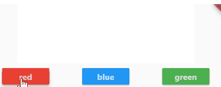

# Flutter Basic Stream Lesson



Use the following:

* StreamController
* StreamBuilder

call the StreamController instance `controller`.

Use the following:

* `controller.stream` to get the stream needed for StreamBuilder
* `controller.add` to add a color to the stream


Create two files:

1. main.dart
2. main_screen.dart

Both files contain a stateless widget.

Set up a `StreamController` in `main.dart`.

```dart
var controller = StreamController.broadcast();
```

Pass the controller to main_screen.dart.

Set up the constructor to receive the controller.

buttons add the color to the data stream.

```dart
controller.add(Colors.red);
```

The StreamBuilder is set up like this:

```dart
  @override
  Widget build(BuildContext context) {
    var stream = controller.stream;

    return Center(
      child: Column(
        children: [
          StreamBuilder(
            stream: stream,
            builder: (BuildContext context, snapshot) {
```


